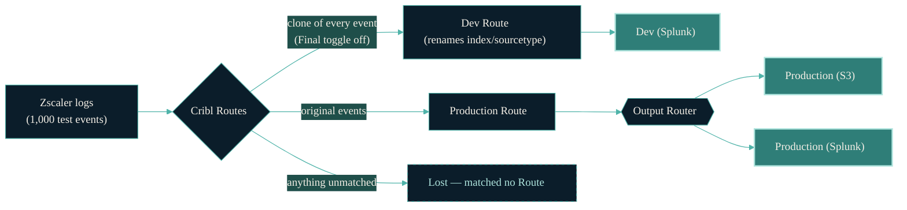

# cc-stream-zscaler-incident-test

**The question this project answers: can our dev/test route in Cribl ever
make production lose data?**

👉 **The current answer, with evidence: [REPORT.md](REPORT.md)** — every test
sends exactly 1,000 events through a real Cribl instance and counts where
every single one ends up.

## The background (no jargon)

Zscaler logs flow through Cribl on their way to Splunk. During an incident,
production event counts dropped by more than 50% right after a dev/test
route's sampling was switched off. Cribl support blamed the dev route
"bleeding" its changes into production traffic. This project rebuilds that
exact setup in a disposable sandbox and measures what actually happens.



The production route sends to **two** destinations through an Output Router
(Splunk + S3), exactly like the real environment. In the sandbox each
destination is a folder of files we can count, so nothing is estimated —
every event is accounted for by its sequence number.

## How to read the results

Each test in [REPORT.md](REPORT.md) shows:

1. **A one-line verdict** — e.g. "✅ No production data was lost."
2. **A flow picture** — 1,000 events in on the left, arrows show how many
   reached each destination. Green boxes = counts matched expectations,
   red = they didn't.
3. **Detailed counts** — collapsed behind a click for anyone who wants the
   exact per-sourcetype numbers.

## The tests

| Test | Question it answers |
| --- | --- |
| `s1-baseline` | Control: production alone passes 1,000/1,000 untouched |
| `s2-incident-unguarded` | The incident config: does the dev route make production lose data? |
| `s3a-guard-eval` | Support's suggested fix (guard on the rename step) |
| `s3b-guard-route-filter` | What happens if the guard is put in the wrong place |
| `s4-sampled-unguarded` | The pre-incident state: dev sampling 1-in-10 turned on |
| `s5-guard-pack-routes` | Alternative guard placement (pack's internal routes) |
| `s6-empty-clone-spec` | UI "Add clone" clicked but left empty |
| `s7-dual-dest` | Old dual-destination shape: two production routes instead of a router |
| `s8-critical` | Critical case: sampling present but disabled, no guard anywhere — runs last so its instance persists for inspection |

## Installation

Nothing to install for GitHub runs. For local runs you need Docker and
Node ≥ 22.6:

```bash
git clone https://github.com/JacobPEvans-personal/cc-stream-zscaler-incident-test.git
cd cc-stream-zscaler-incident-test
```

## Usage

**In GitHub** (no setup needed): open the repo's **Actions** tab → **Incident
Matrix** → **Run workflow**. When it finishes, the run page shows the full
report, and the refreshed [REPORT.md](REPORT.md) is committed automatically.

**Locally**:

```bash
node --experimental-strip-types e2e/run.ts scenarios/*   # all tests, ~2 min each
node --experimental-strip-types e2e/run.ts scenarios/s2-incident-unguarded  # just one
```

## Inspecting a live Cribl instance

Set `KEEP=1` to skip teardown after the last scenario, then log in at
<http://localhost:19000> and click through the exact routes, packs, and
pipelines the run used:

```bash
KEEP=1 node --experimental-strip-types e2e/run.ts scenarios/s8-critical
```

The next run recycles the container; remove it manually with
`docker rm -f cribl-incident`.

### Skipping the registration wizard on kept instances

If `common/first-login/` exists (gitignored — contains your email, the
instance secret, and a crackable password hash), `KEEP=1` runs mount it into
the container's auth dir, so the kept instance is pre-registered and uses
your chosen admin password instead of forcing the first-login flow:

```bash
KEEP=1 CRIBL_PASSWORD='<your password>' node --experimental-strip-types e2e/run.ts scenarios/s8-critical
```

`CRIBL_PASSWORD` is required because the runner's own API calls (pack
installs) must authenticate with the real password once the default
admin/admin is replaced.

To (re)capture the state after registering / changing the password in a kept
container — all three files must come from the **same** container, because
the password hash only validates alongside that instance's `cribl.secret`:

```bash
for f in users.json cribl.secret 676f6174733432.dat; do
  docker cp cribl-incident:/opt/cribl/local/cribl/auth/$f common/first-login/
done
```

### Inspecting CI runs

The workflow takes two `workflow_dispatch` inputs:

- `runner` — runner label (default `ubuntu-latest`)
- `hold_minutes` — keep the last scenario's Cribl alive this long before
  teardown (implies `KEEP=1`)

On GitHub-hosted runners there is no network path to the held container, so
these inputs only pay off with connectivity. Options, in order of preference:

1. **Reproduce locally with `KEEP=1`** — CI runs the identical config, so a
   local run is a faithful replica. Almost always enough.
2. **Tailscale on the GitHub-hosted runner** — add a
   [`tailscale/github-action`](https://github.com/tailscale/github-action)
   step with an ephemeral auth-key secret and browse the held instance over
   your tailnet. Works on public repos without self-hosted infrastructure.
3. **Self-hosted runner** — pass its label as `runner` plus a `hold_minutes`
   value, then browse `http://<runner-host>:19000` on your LAN during the
   hold. **Caveat:** GitHub advises against self-hosted runners on public
   repositories (fork PRs can execute code on your machine). Keep "require
   approval for all outside collaborators" enabled, use a dedicated runner
   group, isolate the runner host on its own network segment — or make this
   repo private first.

## Layout

- `common/` — shared input (tcpjson :10070), the Output Router + filesystem
  destinations, passthrough pipeline
- `packs/` — prod replica + dev variants of the Zscaler pack (differ only in
  sampling/guard placement)
- `scenarios/<id>/` — `route.yml`, `expect.json`, `packs/` symlinks (fully diffable)
- `e2e/run.ts` — the entire runner: container lifecycle, pack install, sender,
  counter, reporter
- `REPORT.md`, `results/` — latest committed evidence

## Contributing

Open a PR. The matrix runs automatically on PRs touching scenarios, packs, or
the runner.

## License

MIT

---

Part of the [JacobPEvans](https://docs.jacobpevans.com) ecosystem.
