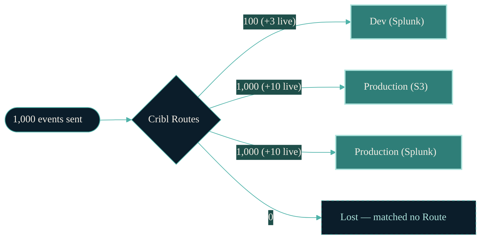
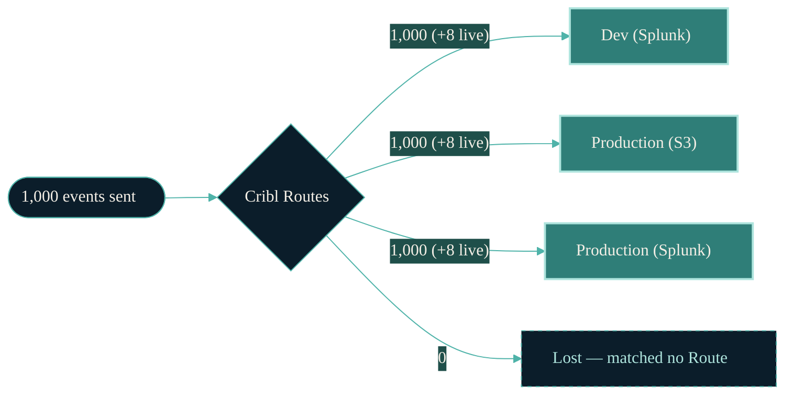
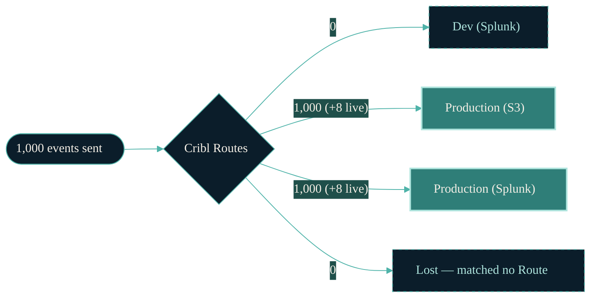
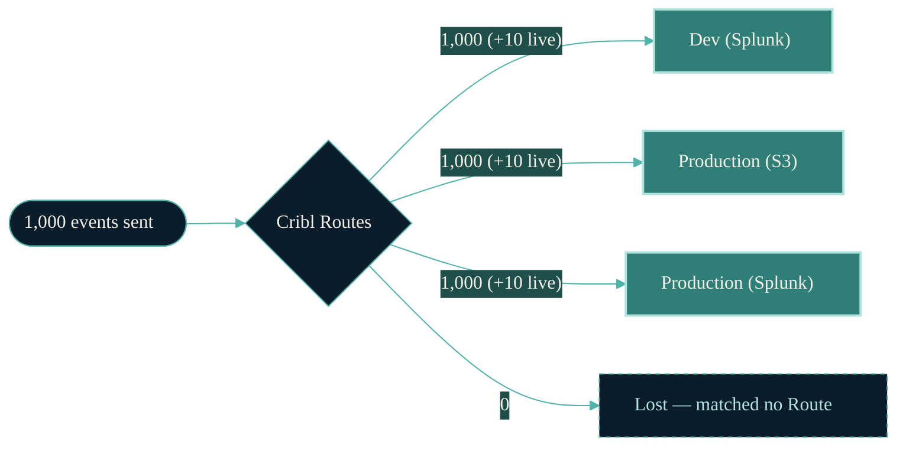

# Cribl routing test results

In every test below, exactly **1,000 events** were sent into a real Cribl
instance, and we counted exactly where every single event ended up.
A live traffic generator (`syslog-zscaler`) also runs the whole time so
the instance behaves like a real environment — its events are shown as
“+N live” but only the 1,000 tracked events decide pass/fail.
Each test's configuration is committed in Cribl before any data flows.
Each test uses a different routing configuration — the point is to see
whether the dev/test route can ever make production lose data.

## At a glance

| Test | Question it answers | Result |
| --- | --- | --- |
| [s1-baseline](#s1-baseline) | Control test: production alone, nothing else configured | ✅ pass |
| [s2-incident-unguarded](#s2-incident-unguarded) | The incident config: does the dev route make production lose data? | ✅ pass |
| [s3a-guard-eval](#s3a-guard-eval) | Support's suggested fix (guard on the rename step) | ✅ pass |
| [s3b-guard-route-filter](#s3b-guard-route-filter) | What happens if the guard is put in the wrong place | ✅ pass |
| [s4-sampled-unguarded](#s4-sampled-unguarded) | The pre-incident state: dev sampling 1-in-10 turned ON | ✅ pass |
| [s5-guard-pack-routes](#s5-guard-pack-routes) | Alternative guard placement (on the pack's internal routes) | ✅ pass |
| [s6-empty-clone-spec](#s6-empty-clone-spec) | UI 'Add clone' clicked but left empty | ✅ pass |
| [s7-dual-dest](#s7-dual-dest) | Old dual-destination shape: two production routes instead of a router | ✅ pass |
| [s8-critical](#s8-critical) | Critical case: sampling present but disabled, no guard anywhere | ✅ pass |

## s1-baseline

**Control test: production alone, nothing else configured**

PROD only, no dev route. Control: 1000 in, 1000 out to prod untouched.

| Setting | This test |
| --- | --- |
| Dev Route | Not configured |
| Dev sampling | Not applicable |
| Renames index/sourcetype | Not applicable |
| Guard on the rename | Not applicable |

✅ **No production data was lost.** Production received 1,000 of 1,000 events sent.

Detailed counts (click to expand)

Sent: 1000 events (index=zscaler, sourcetypes round-robin zscalernss-web, zscalernss-fw, zscalernss-dns)

| Destination | index/sourcetype | Actual | Expected |
| --- | --- | --- | --- |
| Dev (Splunk) | (none) | 0 | 0 |
| Production (S3) | zscaler/zscalernss-dns | 333 | 333 |
| Production (S3) | zscaler/zscalernss-fw | 333 | 333 |
| Production (S3) | zscaler/zscalernss-web | 334 | 334 |
| Production (Splunk) | zscaler/zscalernss-dns | 333 | 333 |
| Production (Splunk) | zscaler/zscalernss-fw | 333 | 333 |
| Production (Splunk) | zscaler/zscalernss-web | 334 | 334 |
| Lost — matched no Route | (none) | 0 | 0 |

## s2-incident-unguarded

**The incident config: does the dev route make production lose data?**

THE INCIDENT: dev route (Final=off, no clone marker), dev pack overwrites index/sourcetype at pipeline end, sampling OFF. If clone bleed were real, prod collapses; if Cribl clones deeply, prod stays 1000.

| Setting | This test |
| --- | --- |
| Dev Route | On — Final toggle off (each matched event is cloned into the dev Pack; the original continues down the Routes) |
| Dev sampling | Off |
| Renames index/sourcetype | On, at the end of each pipeline |
| Guard on the rename | None |

✅ **No production data was lost.** Production received 1,000 of 1,000 events sent.

Detailed counts (click to expand)

Sent: 1000 events (index=zscaler, sourcetypes round-robin zscalernss-web, zscalernss-fw, zscalernss-dns)

| Destination | index/sourcetype | Actual | Expected |
| --- | --- | --- | --- |
| Dev (Splunk) | zscaler_dev/zscalernss-dns:clone | 333 | 333 |
| Dev (Splunk) | zscaler_dev/zscalernss-fw:clone | 333 | 333 |
| Dev (Splunk) | zscaler_dev/zscalernss-web:clone | 334 | 334 |
| Production (S3) | zscaler/zscalernss-dns | 333 | 333 |
| Production (S3) | zscaler/zscalernss-fw | 333 | 333 |
| Production (S3) | zscaler/zscalernss-web | 334 | 334 |
| Production (Splunk) | zscaler/zscalernss-dns | 333 | 333 |
| Production (Splunk) | zscaler/zscalernss-fw | 333 | 333 |
| Production (Splunk) | zscaler/zscalernss-web | 334 | 334 |
| Lost — matched no Route | (none) | 0 | 0 |

## s3a-guard-eval

**Support's suggested fix (guard on the rename step)**

Support's fix: route adds clone:true to cloned events; the overwrite eval inside the dev pack runs only when clone==true.

| Setting | This test |
| --- | --- |
| Dev Route | On — Final toggle off; clone: true added to cloned events |
| Dev sampling | Off |
| Renames index/sourcetype | On, at the end of each pipeline |
| Guard on the rename | On the rename Function (runs only when clone==true) |

✅ **No production data was lost.** Production received 1,000 of 1,000 events sent.

Detailed counts (click to expand)

Sent: 1000 events (index=zscaler, sourcetypes round-robin zscalernss-web, zscalernss-fw, zscalernss-dns)

| Destination | index/sourcetype | Actual | Expected |
| --- | --- | --- | --- |
| Dev (Splunk) | zscaler_dev/zscalernss-dns:clone | 333 | 333 |
| Dev (Splunk) | zscaler_dev/zscalernss-fw:clone | 333 | 333 |
| Dev (Splunk) | zscaler_dev/zscalernss-web:clone | 334 | 334 |
| Production (S3) | zscaler/zscalernss-dns | 333 | 333 |
| Production (S3) | zscaler/zscalernss-fw | 333 | 333 |
| Production (S3) | zscaler/zscalernss-web | 334 | 334 |
| Production (Splunk) | zscaler/zscalernss-dns | 333 | 333 |
| Production (Splunk) | zscaler/zscalernss-fw | 333 | 333 |
| Production (Splunk) | zscaler/zscalernss-web | 334 | 334 |
| Lost — matched no Route | (none) | 0 | 0 |

## s3b-guard-route-filter

**What happens if the guard is put in the wrong place**

Mis-scoped guard: clone==true added to the WG dev route FILTER itself. The field only exists on clones created BY this route, so the filter can never match — dev gets zero events.

| Setting | This test |
| --- | --- |
| Dev Route | On — Final toggle off, but clone==true in its Route filter can never match |
| Dev sampling | Off |
| Renames index/sourcetype | On, at the end of each pipeline |
| Guard on the rename | In the Route filter (wrong place) |

✅ **No production data was lost.** Production received 1,000 of 1,000 events sent.

Detailed counts (click to expand)

Sent: 1000 events (index=zscaler, sourcetypes round-robin zscalernss-web, zscalernss-fw, zscalernss-dns)

| Destination | index/sourcetype | Actual | Expected |
| --- | --- | --- | --- |
| Dev (Splunk) | (none) | 0 | 0 |
| Production (S3) | zscaler/zscalernss-dns | 333 | 333 |
| Production (S3) | zscaler/zscalernss-fw | 333 | 333 |
| Production (S3) | zscaler/zscalernss-web | 334 | 334 |
| Production (Splunk) | zscaler/zscalernss-dns | 333 | 333 |
| Production (Splunk) | zscaler/zscalernss-fw | 333 | 333 |
| Production (Splunk) | zscaler/zscalernss-web | 334 | 334 |
| Lost — matched no Route | (none) | 0 | 0 |

## s4-sampled-unguarded

**The pre-incident state: dev sampling 1-in-10 turned ON**

Pre-incident steady state: unguarded overwrite but sampling 1:10 as first dev pipeline function. Only ~10% of clones survive to dev.

| Setting | This test |
| --- | --- |
| Dev Route | On — Final toggle off |
| Dev sampling | On (1 in 10) |
| Renames index/sourcetype | On, at the end of each pipeline |
| Guard on the rename | None |

✅ **No production data was lost.** Production received 1,000 of 1,000 events sent.

Detailed counts (click to expand)

Sent: 1000 events (index=zscaler, sourcetypes round-robin zscalernss-web, zscalernss-fw, zscalernss-dns)

| Destination | index/sourcetype | Actual | Expected |
| --- | --- | --- | --- |
| Dev (Splunk) | zscaler_dev/zscalernss-dns:clone | 34 | 17–67 |
| Dev (Splunk) | zscaler_dev/zscalernss-fw:clone | 33 | 17–67 |
| Dev (Splunk) | zscaler_dev/zscalernss-web:clone | 33 | 17–67 |
| Production (S3) | zscaler/zscalernss-dns | 333 | 333 |
| Production (S3) | zscaler/zscalernss-fw | 333 | 333 |
| Production (S3) | zscaler/zscalernss-web | 334 | 334 |
| Production (Splunk) | zscaler/zscalernss-dns | 333 | 333 |
| Production (Splunk) | zscaler/zscalernss-fw | 333 | 333 |
| Production (Splunk) | zscaler/zscalernss-web | 334 | 334 |
| Lost — matched no Route | (none) | 0 | 0 |

## s5-guard-pack-routes

**Alternative guard placement (on the pack's internal routes)**

Guard placed on the dev pack's INTERNAL route filters (sourcetype && clone==true) instead of the eval. All entrants are clones, so behavior should match s3a.

| Setting | This test |
| --- | --- |
| Dev Route | On — Final toggle off; clone: true added to cloned events |
| Dev sampling | Off |
| Renames index/sourcetype | On, at the end of each pipeline |
| Guard on the rename | On the dev Pack's internal Routes |

✅ **No production data was lost.** Production received 1,000 of 1,000 events sent.

Detailed counts (click to expand)

Sent: 1000 events (index=zscaler, sourcetypes round-robin zscalernss-web, zscalernss-fw, zscalernss-dns)

| Destination | index/sourcetype | Actual | Expected |
| --- | --- | --- | --- |
| Dev (Splunk) | zscaler_dev/zscalernss-dns:clone | 333 | 333 |
| Dev (Splunk) | zscaler_dev/zscalernss-fw:clone | 333 | 333 |
| Dev (Splunk) | zscaler_dev/zscalernss-web:clone | 334 | 334 |
| Production (S3) | zscaler/zscalernss-dns | 333 | 333 |
| Production (S3) | zscaler/zscalernss-fw | 333 | 333 |
| Production (S3) | zscaler/zscalernss-web | 334 | 334 |
| Production (Splunk) | zscaler/zscalernss-dns | 333 | 333 |
| Production (Splunk) | zscaler/zscalernss-fw | 333 | 333 |
| Production (Splunk) | zscaler/zscalernss-web | 334 | 334 |
| Lost — matched no Route | (none) | 0 | 0 |

## s6-empty-clone-spec

**UI 'Add clone' clicked but left empty**

UI 'Add clone' left empty: clones: [{}] on the dev route (adds no fields), unguarded dev pack. Distinguishes empty-clone-spec semantics from clones: [].

| Setting | This test |
| --- | --- |
| Dev Route | On — Final toggle off; UI Add Clone clicked but left empty |
| Dev sampling | Off |
| Renames index/sourcetype | On, at the end of each pipeline |
| Guard on the rename | None |

✅ **No production data was lost.** Production received 1,000 of 1,000 events sent.

Detailed counts (click to expand)

Sent: 1000 events (index=zscaler, sourcetypes round-robin zscalernss-web, zscalernss-fw, zscalernss-dns)

| Destination | index/sourcetype | Actual | Expected |
| --- | --- | --- | --- |
| Dev (Splunk) | zscaler_dev/zscalernss-dns:clone | 333 | 333 |
| Dev (Splunk) | zscaler_dev/zscalernss-fw:clone | 333 | 333 |
| Dev (Splunk) | zscaler_dev/zscalernss-web:clone | 334 | 334 |
| Production (S3) | zscaler/zscalernss-dns | 333 | 333 |
| Production (S3) | zscaler/zscalernss-fw | 333 | 333 |
| Production (S3) | zscaler/zscalernss-web | 334 | 334 |
| Production (Splunk) | zscaler/zscalernss-dns | 333 | 333 |
| Production (Splunk) | zscaler/zscalernss-fw | 333 | 333 |
| Production (Splunk) | zscaler/zscalernss-web | 334 | 334 |
| Lost — matched no Route | (none) | 0 | 0 |

## s7-dual-dest

**Old dual-destination shape: two production routes instead of a router**

PROD dual destination shape (Splunk + S3): two same-filter routes, prod-a Final=off to fs-s3, prod-b Final=on to fs-prod. Both should get all 1000.

| Setting | This test |
| --- | --- |
| Dev Route | Not configured |
| Dev sampling | Not applicable |
| Renames index/sourcetype | Not applicable |
| Guard on the rename | Not applicable (two production Routes instead of an Output Router) |

✅ **No production data was lost.** Production received 1,000 of 1,000 events sent.

Detailed counts (click to expand)

Sent: 1000 events (index=zscaler, sourcetypes round-robin zscalernss-web, zscalernss-fw, zscalernss-dns)

| Destination | index/sourcetype | Actual | Expected |
| --- | --- | --- | --- |
| Dev (Splunk) | (none) | 0 | 0 |
| Production (S3) | zscaler/zscalernss-dns | 333 | 333 |
| Production (S3) | zscaler/zscalernss-fw | 333 | 333 |
| Production (S3) | zscaler/zscalernss-web | 334 | 334 |
| Production (Splunk) | zscaler/zscalernss-dns | 333 | 333 |
| Production (Splunk) | zscaler/zscalernss-fw | 333 | 333 |
| Production (Splunk) | zscaler/zscalernss-web | 334 | 334 |
| Lost — matched no Route | (none) | 0 | 0 |

## s8-critical

**Critical case: sampling present but disabled, no guard anywhere**

THE CRITICAL CASE: prod + dev routes; dev pipelines contain the sampling function but DISABLED; unguarded index/sourcetype overwrite at pipeline end; clone:true is stamped on cloned events by the route but no filter references it. Staged last so KEEP=1 persists this instance.

| Setting | This test |
| --- | --- |
| Dev Route | On — Final toggle off; clone: true added to cloned events |
| Dev sampling | Present in the pipelines but disabled |
| Renames index/sourcetype | On, at the end of each pipeline |
| Guard on the rename | None |

✅ **No production data was lost.** Production received 1,000 of 1,000 events sent.

Detailed counts (click to expand)

Sent: 1000 events (index=zscaler, sourcetypes round-robin zscalernss-web, zscalernss-fw, zscalernss-dns)

| Destination | index/sourcetype | Actual | Expected |
| --- | --- | --- | --- |
| Dev (Splunk) | zscaler_dev/zscalernss-dns:clone | 333 | 333 |
| Dev (Splunk) | zscaler_dev/zscalernss-fw:clone | 333 | 333 |
| Dev (Splunk) | zscaler_dev/zscalernss-web:clone | 334 | 334 |
| Production (S3) | zscaler/zscalernss-dns | 333 | 333 |
| Production (S3) | zscaler/zscalernss-fw | 333 | 333 |
| Production (S3) | zscaler/zscalernss-web | 334 | 334 |
| Production (Splunk) | zscaler/zscalernss-dns | 333 | 333 |
| Production (Splunk) | zscaler/zscalernss-fw | 333 | 333 |
| Production (Splunk) | zscaler/zscalernss-web | 334 | 334 |
| Lost — matched no Route | (none) | 0 | 0 |

